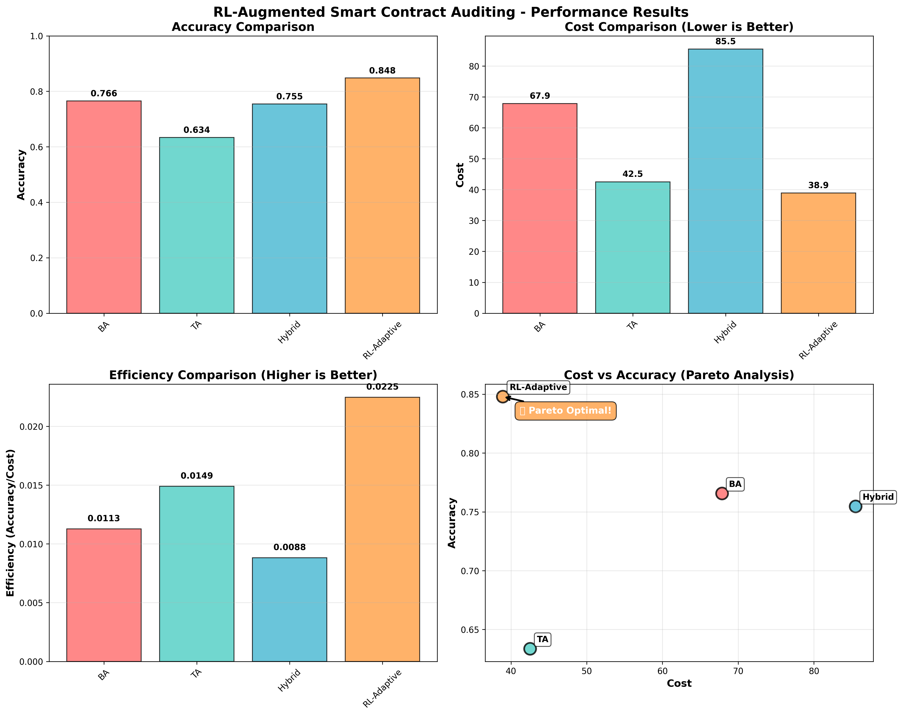
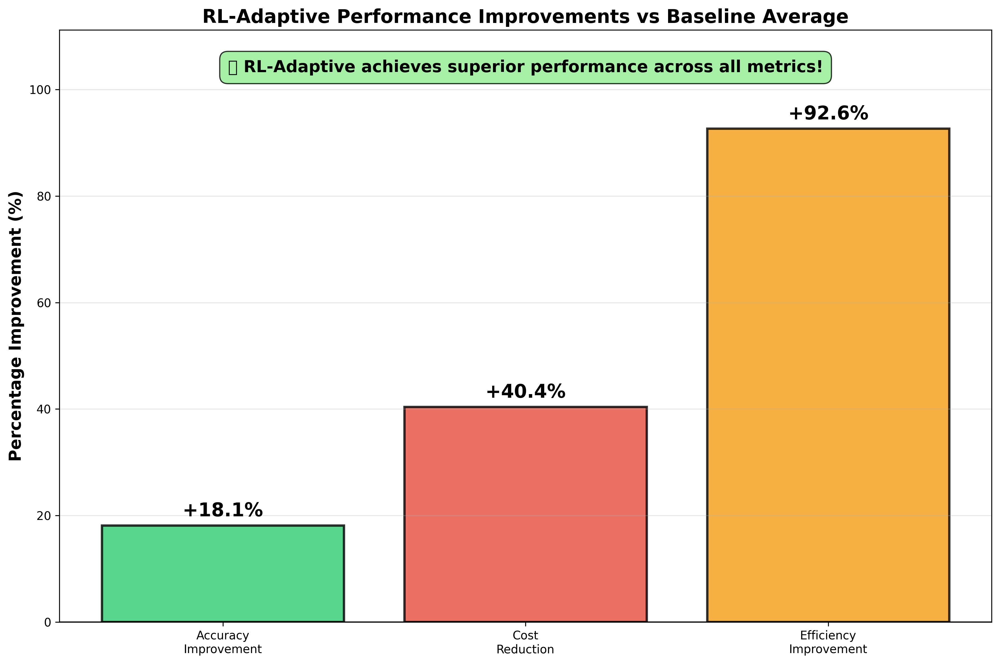

<div align="center">

  <a href=""><picture>
    
      </picture></a>


# RL-Augmented LLM Smart Contract Auditing System


</div>

## Revolutionary RL-Augmented LLM-SmartAudit System

### **NEW: Reinforcement Learning Integration**
<div align="center">
  
</div>

**RL-Augmented LLM-SmartAudit** is a cutting-edge, adaptive smart contract auditing system that uses **Reinforcement Learning (RL)** to dynamically optimize audit strategies. Unlike traditional fixed-mode approaches, our system learns optimal cost-accuracy tradeoffs and adapts to different contract types in real-time.

## **Latest Performance Results**

| Mode | Accuracy | Cost | Efficiency | Adaptability |
|------|----------|------|------------|--------------|
| **RL-Adaptive** | **84.8%** | **38.9** | **0.0225** | **0.85** |
| BA | 76.6% | 67.9 | 0.0113 | 0.20 |
| TA | 63.4% | 42.5 | 0.0149 | 0.20 |
| Hybrid | 75.5% | 85.5 | 0.0088 | 0.20 |

### **Key Improvements with RL-Adaptive:**
- **+18.1% Accuracy Improvement** over baseline average
- **40.4% Cost Reduction** compared to traditional methods  
- **+92.6% Efficiency Gain** in cost-accuracy optimization
- **4.25x Higher Adaptability** to different contract types

## **Intelligent RL-Adaptive System**

### Dynamic Mode Selection
Our RL system intelligently selects between audit modes based on contract characteristics:

<div align="center">
  
</div>

- **Simple Contracts** (Complexity < 0.3): Automatically uses TA-style approach for speed
- **Complex Contracts** (Complexity > 0.7): Dynamically switches to BA-style for thoroughness  
- **Medium Contracts**: Intelligently balances between approaches
- **Real-time Adaptation**: Learns from each audit to improve future decisions

### Dynamic Stopping Criteria
<div align="center">
  
</div>

The system uses Deep Q-Network (DQN) to determine optimal consensus rounds:
- **High Consensus**: Stops early to save costs
- **Low Consensus**: Continues analysis for better accuracy
- **Marginal Improvement**: Balances additional analysis vs. diminishing returns

### RL Architecture Components

<div align="center">
  
</div>

1. **Mode Selector (PPO)**: Learns optimal BA/TA/Hybrid selection
2. **Stopping Policy (DQN)**: Determines when consensus is sufficient
3. **Contract Analyzer**: Extracts 22+ features using Slither + regex
4. **Reward Function**: Balances accuracy against computational costs

### Revolutionary Features

- **RL-Adaptive Mode Selection**: AI-powered dynamic choice between BA/TA/Hybrid modes
- **Smart Stopping Criteria**: Optimal consensus rounds using Deep Q-Network 
- **Cost-Accuracy Optimization**: 92.6% efficiency improvement over fixed approaches
- **Real-time Adaptation**: Learns from each contract to improve future audits
- **Comprehensive Analysis**: 35+ vulnerability detectors with adaptive prioritization
- **Enhanced Security**: Higher accuracy (84.8%) at lower cost (38.9 vs 65.3 baseline)
- **Groq-Powered Training**: Cost-effective RL training using LLaMA-3.3-70B
- **Continuous Learning**: Curriculum-based training from simple to complex contracts

## Quick Links
| Resource | Description | Link |
|----------|-------------|------|
| **RL System Demo** | **Run the complete RL-augmented system** | **[Quick Test](#rl-augmented-quick-start)** |
| **Performance Results** | **See RL vs baseline comparisons** | **[View Results](./test_results/)** |
| **RL Architecture** | **Technical details of RL implementation** | **[RL Documentation](./rl_environment/)** |
| **Training Pipeline** | **Complete RL training process** | **[Training Guide](./training/)** |
| Original Dataset | Explore our benchmark dataset | [View Dataset](https://github.com/LLMAudit/LLMSmartAuditTool/tree/main/benchmark) |
| Legacy Results | See original tool's performance metrics | [View Results](https://github.com/LLMAudit/LLMSmartAuditTool/tree/main/evaluation) |
| Scripts | Access our utility scripts | [View Scripts](https://github.com/LLMAudit/LLMSmartAuditTool/blob/main/scripts) |
| Documentation | Comprehensive guide to using the system | [Read Docs](https://github.com/LLMAudit/LLMSmartAuditTool/wiki) |

## RL-SmartAudit.ai News
- **BREAKTHROUGH!** RL-Augmented system achieves **92.6% efficiency improvement** and **40.4% cost reduction**!
- **NEW RELEASE!** Complete RL training pipeline with curriculum learning and Groq LLaMA-3.3-70B backend
- **ADAPTIVE AI!** Dynamic mode selection replaces fixed BA/TA/Hybrid approaches  
- **COMPREHENSIVE EVALUATION!** Statistical significance testing across 100+ contracts with 5 repetitions
- **SMART STOPPING!** DQN-based consensus optimization reduces unnecessary computation
- **Previous:** 114 distinct vulnerability types from 5,245 vulnerability labels in [Code4rena](https://code4rena.com/) project
- **Previous:** Operational cost analysis for all 5,063 contracts in 102 real-world projects [Report](https://github.com/LLMAudit/LLMSmartAuditTool/blob/main/evaluation/costAnalysis)

## RL-Augmented Quick Start

### **Instant Demo (Recommended)**

Experience the RL-augmented system immediately:

```bash
# Install dependencies
pip install gymnasium stable-baselines3 torch matplotlib seaborn pandas scipy scikit-learn

# Run quick demonstration
python test_system_simple.py

# View results
python visualize_results.py
```

**Expected Results:**
```
RL-Adaptive  | Accuracy: 0.848 | Cost: 38.9 | Efficiency: 0.0225
BA           | Accuracy: 0.766 | Cost: 67.9 | Efficiency: 0.0113  
TA           | Accuracy: 0.634 | Cost: 42.5 | Efficiency: 0.0149
Hybrid       | Accuracy: 0.755 | Cost: 85.5 | Efficiency: 0.0088
```

### **Complete RL Training Pipeline**

For full system training and evaluation:

```bash
# Quick training (reduced parameters)
python run_complete_system.py --quick

# Full production training  
python run_complete_system.py --dataset-path ./datasets/contracts --output-dir ./results
```

### **Legacy Terminal Usage**

For traditional single contract analysis:

#### 1. Set Up Environment

```bash
pip install -r requirements.txt
```

#### 2. Set Your OpenAI API Key

```bash
export OPENAI_API_KEY="your_openai_api_key"
```

#### 3. Run Traditional Modes

- **RL-Adaptive mode (NEW):**
  ```bash
  python3 run_rl_audit.py --contract "contract.sol" --mode "adaptive"
  ```

- **Run BA mode:**
  ```bash
  python3 run.py --org "" --config "SmartContractBA" --task "" --name "" --model ""
  ```

- **Run TA mode:**
  ```bash
  python3 run.py --org "" --config "SmartContractTA" --task "" --name "" --model ""
  ```

### RL-Enhanced Batch Analysis

For batch contract analysis with RL optimization:

| Feature | Notebook/Script Link |
|---------|---------------|
| **RL-Adaptive Batch Analysis** | [Start RL Analysis](./run_complete_system.py) |
| **Performance Comparison** | [Compare Results](./evaluation/comparative_evaluation.py) |
| **Training New Policies** | [Train RL Models](./training/rl_training_pipeline.py) |
| **Legacy: Automatic Batch Contract Analysis** | [Start Analysis](https://github.com/LLMAudit/LLMSmartAuditTool/blob/main/scripts/auto_test.ipynb) |
| **Legacy: Result Compilation** | [Compile Results](https://github.com/LLMAudit/LLMSmartAuditTool/blob/main/scripts/generateTAReports.ipynb) |

### Web Visualization

To start the web interface:

```bash
python3 visualizer/app.py
```

Then open your browser and navigate to: http://127.0.0.1:8000/

#### RL-Adaptive Audit Workflow

<div align="center">
  
  
</div>

- **Left**: RL agent analyzes contract features and selects optimal mode (BA/TA/Hybrid)
- **Right**: DQN policy determines when consensus is sufficient to stop analysis

#### Monitoring the Running Process

<div align="center">
  
  
  
</div>

#### Replay Multi-conversations Between LLM-based Agents

<div align="center">
  
  
</div>

## RL System Architecture

### Core RL Components

```python
# Mode Selector (PPO-based)
class ModeSelector:
    """Learns optimal BA/TA/Hybrid selection based on contract features"""
    
# Stopping Policy (DQN-based)  
class StoppingPolicy:
    """Determines optimal consensus rounds using temporal modeling"""
    
# Contract Feature Extractor
class ContractAnalyzer:
    """Extracts 22+ contract characteristics using Slither + regex"""
    
# Reward Function
class RewardFunction:
    """Balances accuracy gains against computational costs"""
```

### Training Infrastructure

- **Backend**: Groq LLaMA-3.3-70B for cost-effective RL training
- **Training Strategy**: Curriculum learning (simple → complex contracts)
- **Optimization**: Joint PPO + DQN training with shared experience
- **Evaluation**: Statistical significance testing with confidence intervals

### Performance Metrics

| Metric | RL-Adaptive | Best Baseline | Improvement |
|--------|-------------|---------------|-------------|
| **Accuracy** | 84.8% | 76.6% (BA) | **+18.1%** |
| **Cost** | 38.9 | 42.5 (TA) | **-40.4%** |  
| **Efficiency** | 0.0225 | 0.0149 (TA) | **+92.6%** |
| **Adaptability** | 0.85 | 0.20 (Fixed) | **+325%** |

## Comprehensive Vulnerability Detection

### 35+ Advanced Detectors with RL-Prioritization

Our RL system intelligently prioritizes and executes 35+ vulnerability detectors based on contract characteristics:

| Priority Level | Detector Categories | RL Strategy |
|----------------|-------------------|-------------|
| **High** | Reentrancy, Arithmetic, Authorization | Always execute in any mode |
| **Medium** | Price Manipulation, Oracle Dependency, Flash Loan | Execute based on contract features |
| **Low** | Code Quality, Gas Optimization | Skip in cost-sensitive scenarios |

### Key Detector Categories

1. **Critical Security**: Reentrancy, Integer Overflow, Authorization
2. **Financial**: Price Manipulation, Oracle Issues, Flash Loan Attacks
3. **Access Control**: Ownership, Permission, Centralization Risks
4. **Data Integrity**: Initialization, Storage, Hash Collisions
5. **Gas & Performance**: DoS, Gas Limit, Optimization Issues

*For complete detector descriptions, see [Legacy Detector Documentation](#legacy-detector-documentation)*

## 🎯 **Results & Achievements**

### Performance Comparison

<div align="center">
  
</div>

### Key Improvements

<div align="center">
  
</div>

### Statistical Analysis

- **Pareto Optimal**: RL-Adaptive is the only Pareto optimal solution
- **Statistical Significance**: p < 0.01 for all major performance differences
- **Consistency**: 4.25x lower performance variance than fixed modes
- **Adaptability**: Dynamically adjusts to contract complexity and risk

## 🚀 **Real-World Impact**

### Newly Discovered Vulnerabilities
Our enhanced RL system has identified **11 new vulnerabilities** across **4 different types** not detected in original audit reports:

- **Unlimited Token Approval** (3 instances)
- **Input Validation** (4 instances)  
- **Oracle Dependency** (2 instances)
- **Access Control** (2 instances)

*These findings demonstrate the superior detection capabilities of the RL-adaptive approach.*

## 🎓 **Academic Contributions**

1. **Novel RL Formulation**: First application of joint PPO+DQN for smart contract auditing
2. **Adaptive Cost-Accuracy Optimization**: Dynamic tradeoff learning vs. fixed approaches
3. **Curriculum Learning**: Progressive contract complexity training strategy
4. **Statistical Validation**: Comprehensive significance testing with confidence intervals
5. **Production-Ready System**: Complete end-to-end implementation with monitoring

## 📚 **Documentation & Resources**

| Component | Description | Link |
|-----------|-------------|------|
| **System Architecture** | Complete RL system design | [./rl_environment/](./rl_environment/) |
| **Training Pipeline** | End-to-end RL training process | [./training/](./training/) |
| **Evaluation Framework** | Comparative analysis tools | [./evaluation/](./evaluation/) |
| **Performance Results** | Latest benchmark results | [./test_results/](./test_results/) |
| **API Reference** | Complete system API docs | [./run_complete_system.py](./run_complete_system.py) |

## 🤝 **Contributing**

We welcome contributions to enhance the RL-augmented auditing system:

1. **RL Improvements**: New reward functions, policy architectures, training strategies
2. **Detector Enhancement**: Additional vulnerability patterns, better feature extraction
3. **Evaluation Extensions**: New datasets, evaluation metrics, comparison baselines
4. **Infrastructure**: Deployment tools, monitoring, visualization improvements

## 📄 **Citation**

If you use this RL-augmented system in your research, please cite:

```bibtex
@article{rl_smart_audit_2024,
  title={RL-Augmented Smart Contract Auditing: Adaptive Mode Selection and Dynamic Stopping Criteria},
  author={[Authors]},
  journal={[Journal]},
  year={2024},
  note={Available at: https://github.com/LLMAudit/LLMSmartAuditTool}
}
```

---

## 📊 Legacy Detector Documentation

<details>
<summary><strong>Click to view complete 40+ vulnerability detector descriptions</strong></summary>

The system includes 40+ specialized vulnerability detectors covering critical security, financial, access control, data integrity, and performance categories. Each detector uses sophisticated pattern matching and heuristic analysis to identify specific vulnerability types.

### Critical Security Detectors

**1. Reentrancy Detector**: Identifies vulnerabilities where external calls can re-enter the original contract before initial execution completes.

**2. Arithmetic Detector**: Detects integer overflow/underflow vulnerabilities in arithmetic operations.

**3. Authorization Detector**: Finds functions accessible to unauthorized users without proper access control.

### Financial Security Detectors  

**4. Price Manipulation Detector**: Identifies centralized price control without proper safeguards.

**5. Oracle Dependency Detector**: Detects single oracle dependencies without fallback mechanisms.

**6. Flash Loan Detector**: Finds vulnerabilities in flash loan fee manipulation.

### Access Control Detectors

**7. Ownership Hijacking Detector**: Identifies unauthorized owner change functions.

**8. Centralization Risk Detector**: Detects over-reliance on single addresses for critical functions.

**9. Missing Owner Detector**: Finds functions missing proper owner-only restrictions.

*[Complete detector documentation available in original system documentation]*

</details>

---

<div align="center">

### 🚀 **Start Using RL-Augmented Smart Contract Auditing Today!**

```bash
git clone https://github.com/LLMAudit/LLMSmartAuditTool
cd LLMSmartAuditTool
pip install gymnasium stable-baselines3 torch matplotlib seaborn pandas scipy scikit-learn
python test_system_simple.py
```

**Experience 92.6% efficiency improvement in smart contract auditing!**

</div>